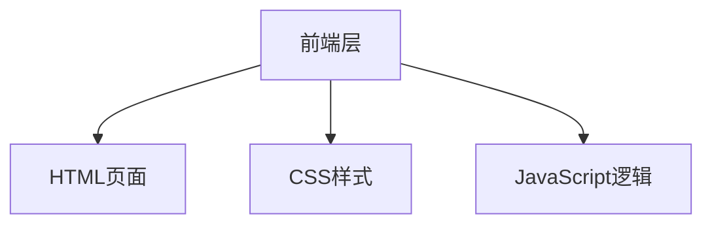

## 1. 架构设计

## 2. 技术描述

- 前端：HTML5 + CSS3 + JavaScript（原生）
- 部署：GitHub Pages
- 不需要后端和数据库

## 3. 页面结构

| 文件名 | 用途 |
|-------|---------|
| index.html | 主页面，包含所有HTML结构 |

## 4. 核心功能实现

- 密码生成算法：基于用户选择的字符类型和长度生成随机密码
- 字符集：
  - 小写字母：a-z
  - 大写字母：A-Z
  - 数字：0-9
  - 特殊符号：!@#$%^&*()_+-=[]{}|;:,.<>?
- 复制功能：使用 Clipboard API

