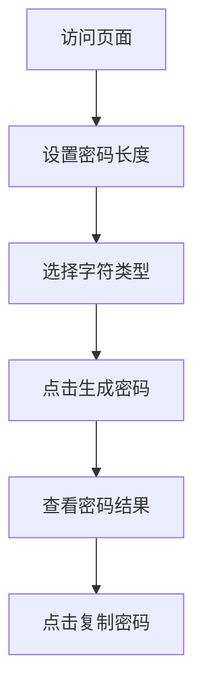

## 1. 产品概述

这是一个密码生成器工具，用于快速生成安全、随机的密码，解决用户创建强密码的需求，面向所有需要安全密码的互联网用户。

- 提供直观的密码生成和复制功能
- 帮助用户提高账户安全性

## 2. 核心功能

### 2.1 功能模块

1. **主页面**：密码生成器界面，包含选项选择区和结果展示区

### 2.2 页面详情

| 页面名称 | 模块名称 | 功能描述 |
|-----------|-------------|---------------------|
| 主页面 | 密码长度调节 | 滑块控制密码长度（8-32位） |
| 主页面 | 字符类型选择 | 勾选框选择是否包含大小写字母、数字、特殊符号 |
| 主页面 | 密码展示 | 显示生成的密码结果 |
| 主页面 | 复制功能 | 一键复制密码到剪贴板 |
| 主页面 | 生成按钮 | 点击生成新密码 |

## 3. 核心流程

用户访问页面 → 选择密码长度和字符类型 → 点击生成按钮 → 查看并复制密码

## 4. 用户界面设计

### 4.1 设计风格

- 主色调：深蓝色（#165DFF）配黑色（#1D2129）
- 按钮风格：圆角矩形，悬停效果
- 字体：使用现代无衬线字体，清晰易读
- 布局风格：卡片式居中布局
- 图标风格：简洁的线性图标

### 4.2 页面设计概述

| 页面名称 | 模块名称 | UI元素 |
|-----------|-------------|-------------|
| 主页面 | 整体布局 | 居中卡片，渐变背景，柔和阴影 |
| 主页面 | 控件区域 | 滑块、复选框、按钮的合理间距 |
| 主页面 | 结果区域 | 大字号显示密码，复制按钮 |

### 4.3 响应式设计

桌面优先，支持移动端适配，触摸交互优化

